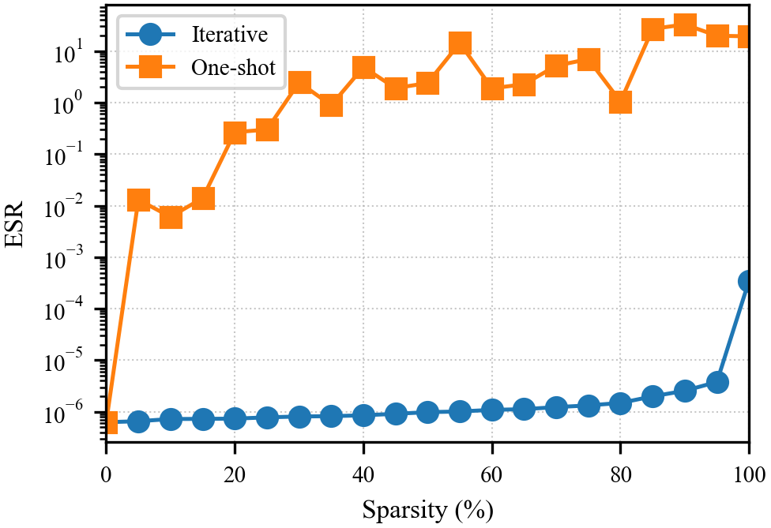
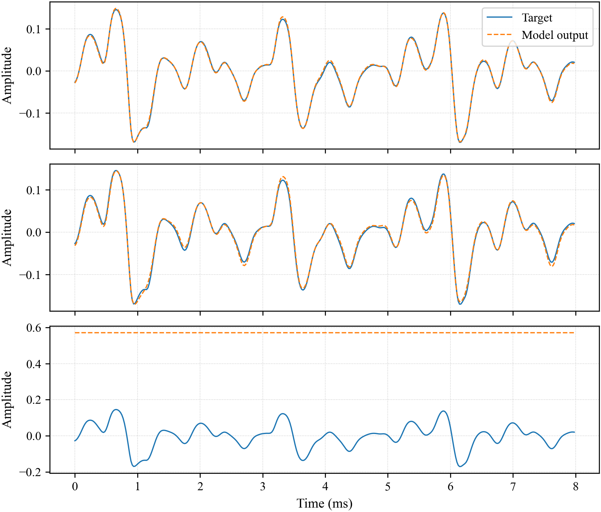

# WaveNet-Style Guitar Amplifier Model Pruning

**A WaveNet-style neural guitar amplifier, iteratively magnitude-pruned to 90% sparsity for real-time deployment — with no perceptible loss in quality.**

This repository holds the PyTorch training and pruning pipeline behind our DAFx26 demo paper, *WaveNet-Style Guitar Amplifier Model Pruning for Real-Time iOS Deployment* (Ryota Sato and Eli Silverstein, Stanford University). It trains WaveNet-style networks to emulate tube amps and distortion pedals, then sparsifies them with iterative magnitude pruning so that 90% of the weights can be removed while the model still tracks the target amplifier.

<p align="center">
  
  
</p>

<p align="center"><em>Left: iterative pruning holds accuracy to high sparsity while one-shot pruning collapses. Right: the 90% iteratively-pruned model tracks the target waveform; one-shot pruning at the same sparsity does not.</em></p>

## Highlights

- **90% sparsity, no audible degradation.** Across four in-house amp/pedal captures (Vox AC15, Fender Deluxe Reverb, Fender Tweed-style, Dunlop Fuzz Face), the 90%-pruned model reaches an error-to-signal ratio (ESR) below `3.4e-4`.
- **Iterative beats one-shot.** The mask is updated every mini-batch along an exponential sparsity schedule so the network adapts to sparsity during training. Naive one-shot pruning collapses well before 90%.
- **Small model.** The 16-channel WaveNet has 21,913 parameters (21,152 prunable); at 90% sparsity, 19,074 weights are removed.
- **Built for real time.** This sparsity is what makes an otherwise intractable WaveNet-style model run in real time on a CPU-only iPhone (RTF ≈ 0.6 at 90%). The real-time C++/iOS inference engine described in the paper is **coming soon**; this repository is the model training and pruning side.

## Architecture

A causal, feedforward WaveNet variant (`model_cfg/ch16_ungated.json`) that maps the raw input guitar waveform directly to the distorted output: channel dimension `C = 16`, kernel size 3, and an 18-layer dilation pattern `{1, 2, 4, …, 256, 1, 2, 4, …, 256}`. Following the neural-amplifier setup of Wright et al., we use standard `tanh` nonlinearities (ungated) to keep the later C++ deployment cheap. The model is trained with an MSE loss on a pre-emphasized signal and evaluated with ESR.

## Installation

```bash
conda env create -f environment.yml
conda activate wavenet-imp
```

## Usage

### Train (standard, no pruning)

```bash
python train.py --model_cfg model_cfg/ch16_ungated.json
```

### Train with iterative magnitude pruning (IMP)

```bash
python train_imp.py --model_cfg model_cfg/ch16_ungated.json
```

Pruning defaults match the paper: 90% target sparsity, local magnitude pruning, exponential schedule, ramped from epoch 10 to epoch 750. See the argument parser in `train_imp.py` for the full list (`--sparsity_target`, `--prune_type`, `--prune_schedule`, `--prune_start_epoch`, `--prune_end_epoch`, and the shared training args).

**Both scripts** write to `checkpoints/<run_stamp>/`, containing:

- `source.wav` — input fed into the model
- `target.wav` — amplifier output captured by microphone
- `model_output.wav` — WaveNet prediction on the validation segment
- `losses.json` — per-epoch train/val loss history
- `logs.txt` — run logs
- `*.pt` — checkpoint of the best epoch (lowest validation loss)

The default input/target is `data/example/`; point `--input_wav` / `--target_wav` at any capture under `data/` to train a different device.

### Evaluate a trained model on a wav

`eval.py` loads a checkpoint (transparently materializing pruned `*_orig`/`*_mask` tensors) and renders an output wav. Point `--model_path` at any `*.pt` inside a run directory:

```bash
python eval.py \
  --model_path models/amp_captures/fuzzface_high-b40-lr0.001-e1500-p90-local-exponential-ps10-pe750-2026-03-10_06-36-14-432369/fuzzface_high-b40-lr0.001-e1500-p90-local-exponential-ps10-pe750-2026-03-10_06-36-14-432369-epoch_1437-loss_2.14025e-05.pt \
  --input_wav data/example/input.wav
```

Output is written to `outputs/<input filename>.wav` by default.

### Inspect a checkpoint

```bash
python models/model_info.py <path-to-.pt>
```

Prints the stored config and reports total, prunable, and pruned parameter counts along with the achieved sparsity.

### Batch-train over a data root

```bash
bash run_pipeline.sh data
```

Trains one model per `input.wav` / `<dirname>.wav` pair found under the given directory.

## Repository layout

| Path | Contents |
| --- | --- |
| `train.py` | Standard WaveNet training |
| `train_imp.py` | Training with iterative magnitude pruning |
| `one_shot_prune.py` | One-shot pruning of a trained model (the baseline IMP is compared against) |
| `eval.py` | Render a trained model over an input wav |
| `run_pipeline.sh` | Batch training over all capture pairs under a data root |
| `utils/` | WaveNet model (`wavenet.py`) and audio/training helpers (`util.py`) |
| `model_cfg/` | Model architecture configs (`ch16_ungated.json` is the paper model) |
| `models/` | Trained models and their audio examples (see below) |
| `data/` | Amp/pedal capture wavs — `input.wav` (dry) and `<name>.wav` (target) pairs |
| `plots/` | Figure-generation script `plot.py` and the two committed hero figures |
| `environment.yml` | Conda environment |

### `models/` directory

Contains trained models and their audio examples. Each run folder holds `source.wav`, `target.wav`, `model_output.wav`, `losses.json`, `logs.txt`, and the best-epoch `*.pt` weights. Subdirectories:

- `amp_captures/` — 24 amp/pedal captures, each trained at 90% sparsity.
- `one_shot_sweep/` — one-shot pruning applied to a single 0% model at sparsity levels from 5% to 100% (in 5% steps). Same base 0% model as `sparsity_level_sweep`.
- `prune_end_sweep/` — sweep over the pruning end epoch (`pe`).
- `prune_type_schedule/` — sweep over prune type (global/local) and schedule (linear/exponential).
- `sparsity_level_sweep/` — sparsity-level sweep using the best configuration found above.

#### Run naming scheme

```
[model_name-]b{batch}-lr{lr}-e{epochs}-p{sparsity%}-{prune_type}-{schedule}-ps{prune_start}-pe{prune_end}-{timestamp}
```

- `model_name` — amp name prefix (only present in `amp_captures/`; elsewhere runs start with `output-`)
- `b` — batch size, `lr` — learning rate, `e` — total epochs
- `p` — target sparsity (%), `prune_type` — `global`/`local`, `schedule` — `linear`/`exponential`
- `ps` — prune-start epoch, `pe` — prune-end epoch
- `timestamp` — `YYYY-MM-DD_HH-MM-SS-ffffff`

Unpruned runs omit the `p{...}-...-pe{...}` block (e.g. `output-b40-lr0.001-e1500-{timestamp}`).

## Reproducing the paper figures

All figures and the reported quality metrics are produced by a single script:

```bash
python plots/plot.py
```

It reads the trained run directories under `models/` (`losses.json`, `model_output.wav`, `target.wav`) and writes figures into `plots/`. Concretely, `plot.py`:

- **`prune_scheduler_ieee.png`** — the linear vs. exponential sparsity ramp over epochs, computed with the same schedule as `train_imp.py` (start 10, end 750, target 90%).
- **`loss_curves_ieee.png`** — train/validation ESR curves for the four `prune_type_schedule` runs (global/local × linear/exponential) at 90% sparsity.
- **`sparsity_sweep_ieee.png`** *(committed)* — minimum validation ESR vs. sparsity from 0–100%, comparing iterative pruning (`sparsity_level_sweep/`) against one-shot pruning (`one_shot_sweep/prune_summary.json`).
- **`waveform_overlap_stacked_ieee.png`** *(committed)* — a three-panel model-vs-target waveform overlap for the unpruned, iterative (IMP), and one-shot models at 90%.
- **`nam_spectrogram_ieee.png`** and **`fuzzface_high_spectrogram_ieee.png`** — mel-scale STFT spectrogram pairs (model output vs. target) for a held-out signal and the Fuzz Face capture.

It also prints, to stdout, the multi-resolution STFT distance (spectral convergence and log-magnitude L1) for the two spectrogram runs, and a copy-paste LaTeX table of the minimum validation ESR for every amp capture.

Only the two hero figures are committed to the repository; the rest are git-ignored and regenerated on demand by the script.

## Citation

If you use this work, please cite the DAFx26 demo paper:

```bibtex
@inproceedings{sato2026wavenetpruning,
  title     = {WaveNet-Style Guitar Amplifier Model Pruning for Real-Time iOS Deployment},
  author    = {Sato, Ryota and Silverstein, Eli},
  booktitle = {Proceedings of the 29th International Conference on Digital Audio Effects (DAFx26)},
  address   = {Cambridge, MA, USA},
  year      = {2026},
  note      = {Demo}
}
```

## Acknowledgments

This project grew out of the final project for EE264W: Digital Signal Processing at Stanford, whose real-time iOS audio framework was developed by Fernando Mujica. Thanks to Professor Fernando Mujica and Ron Schafer for their guidance throughout.
